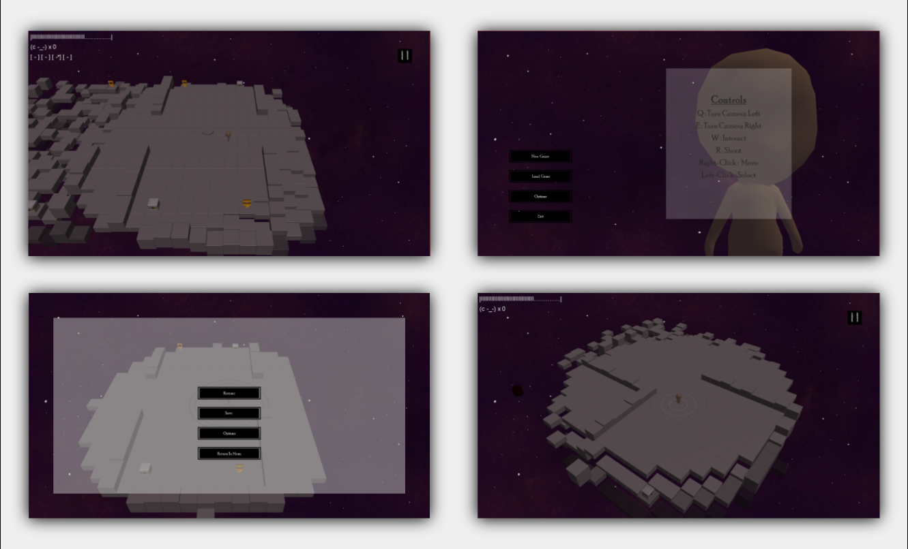
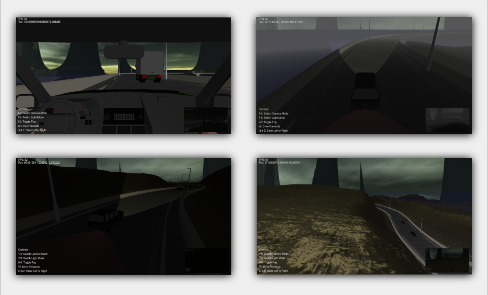
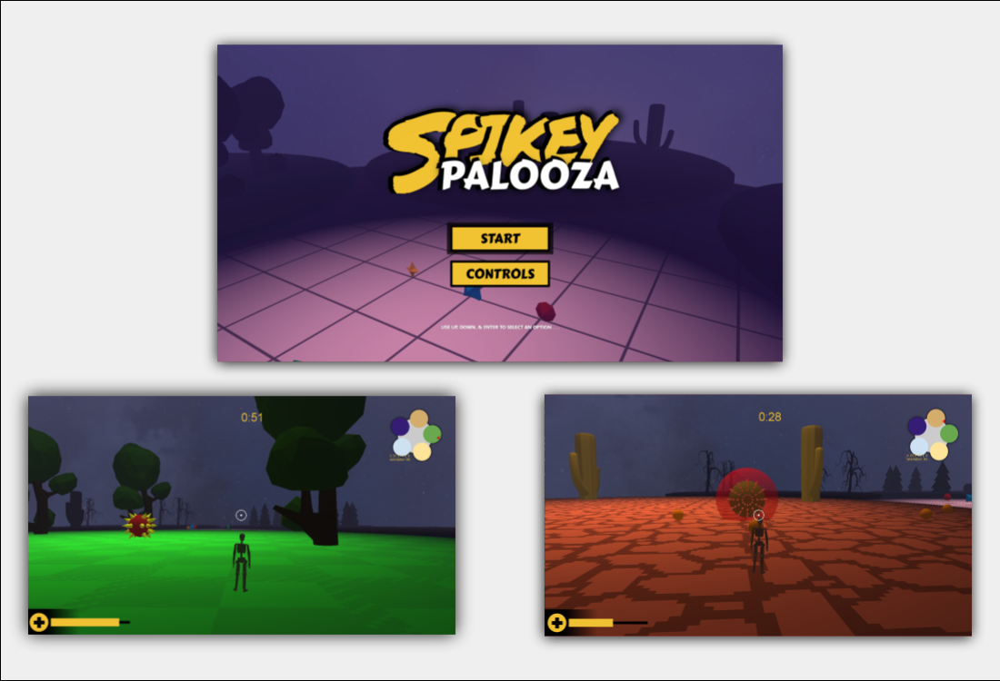
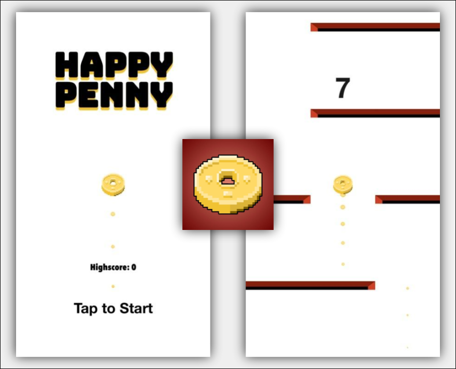

# Portfolio
Hello, I am Othmane Tazi! This repository contains a description of most of my game projects. The games bellow are presented from newest to the oldest. Each one showcases different skills that are relevant in game development. This portfolio is not exhaustive but it showcases some of my noteworthy porjects.

Code samples are not provided on Github since github has a code search feature and my professors are concerened that other student could potentially copy my work. However I have uploaded the code to my drive with a link under each listed project.

 

## Games Architecture

Video Demo: https://drive.google.com/file/d/14RZ7oZQO2OCvi-CSp_utIEaHwyGPFzjf/view?usp=drive_link

  

**Platform:** Windows, MacOS  
**Name:** None   
**Language**: C#  
**Frameworks**: XNA, Monogame  

### Description:
This project was assigned to me as part of my Computer Games Architecture module. The game is a captivating 3D top-view dungeon crawler, and its development revolves around the principles of modularity and efficient event-driven architecture. To ensure code quality and maintainability, I employed various common design patterns, including Singleton, Observer, and Factory, where appropriate.

The game boasts an array of impressive features, such as data-driven world construction, allowing for dynamic and customizable game environments. Additionally, I implemented a robust serialization mechanism for efficient data handling, enabling seamless loading and saving of game progress.

To enhance performance and organization, I meticulously separated the collision detection and collision response processes, leading to smoother and more responsive gameplay. This thoughtful approach contributes to an overall immersive player experience.

As a testament to the project's innovation, I crafted a versatile and user-friendly UI framework. This framework incorporates custom reusable templates, simplifying the creation and implementation of new UI elements, ensuring quick and effortless customization.

By skillfully blending these components and leveraging the power of modern game development techniques, the project resulted in a captivating and engaging game that stands as a testament to the principles of good architecture and design.

**Code:** https://drive.google.com/drive/folders/11dtWF76BDZycgIeMCsvj51KksZdpl7BD?usp=drive_link

 

## Computer Graphics

  

**Platform:** Windows  
**Name:** None   
**Language**: C++   
**Frameworks**: GLM, GLEW  

### Description:
This engaging game project was an integral part of my Computer Graphics module, where I skillfully demonstrated my proficiency with the OpenGL API and expertise in implementing stunning visual effects using shaders. To create an immersive experience, I meticulously designed and constructed many objects (meshes) manually. This involved defining various properties such as vertex positions, texture coordinates, and normals. These essential properties were efficiently passed to the shaders using Vertex Array Objects (VAO) and Vertex Buffer Objects (VBO).

The true beauty of the game lies in the exquisite visual effects achieved through the implementation of advanced shader techniques. Among the breathtaking effects are the captivating fog, realistic bump mapping, and seamless multi-texturing, which combine to create a visually stunning and lifelike environment.

The game's lighting system was ingeniously designed with two distinctive types: directional lighting and spotlighting. The player can dynamically toggle these lighting modes on and off based on their input, allowing for an interactive and dynamic gaming experience.

Furthermore, I utilized a Frame Buffer Object (FBO) to craft a unique rear view window in the heads-up display (HUD). This clever addition provides the player with an invaluable perspective, enhancing their situational awareness and adding an extra layer of gameplay depth.

Overall, this project serves as a testament to my proficiency in Computer Graphics, highlighting my ability to implement complex visual effects, leverage the power of shaders, and create captivating gameplay experiences using the OpenGL API.

**Code:** https://drive.google.com/drive/folders/12wgmbqOlwcniPDDUXpaJhDJf6fLjIY6q?usp=drive_link

 

## Advanced Game technologies / Gameplay development

Video Demo: https://drive.google.com/file/d/1CUO8s_5ov7IDam3uuuMmOBCiJYw8rBnx/view?usp=drive_link

  

**Platform:** Windows  
**Name:** Spikey Ball Palooza  
**Language**: C++  
**Frameworks**: GLM, GLFW, FMOD, BulletEngine  

### Description:

This ambitious project was a pivotal part of my Advanced Games Technologies module, showcasing my expertise in implementing crucial features, innovative ideas, and mastery in 3D mathematics. The game itself is an engaging third-person shooter, challenging players to defeat region bosses while highlighting my diverse skill set.

The project incorporates a range of essential features, including seamless player input, a sophisticated camera technique for a smooth and immersive experience, and dynamic lighting strategies that enhance the game's visual appeal. To bring life to the virtual world, I integrated mesh animations and captivating sound effects, creating a realistic and enjoyable gameplay environment.

A simple yet functional heads-up display (HUD) was thoughtfully included, featuring a health bar, timer, and a minimap to aid the player in their quest. These additions contribute to a seamless and immersive gaming experience.

Creativity shines through in the gameplay design, where I introduced inventive ideas to elevate the player's experience. The game showcases three distinct types of projectiles and five unique pickups, each serving a distinct purpose, adding strategic depth and excitement to the gameplay.

One of the game's highlights is the presence of five diverse enemy non-player characters (NPCs), each equipped with their own unique set of attacks and moves. The enemies' behavior is expertly managed through finite state machines, making their actions intelligent and challenging.

Throughout the project, 3D mathematics played a pivotal role in various aspects, including physics simulations, collision detection, camera manipulation, and essential transformations such as scaling, rotation, and translation.

In conclusion, this project is a testament to my ability to create captivating and feature-rich games, demonstrating expertise in vital game development elements, innovative gameplay mechanics, and the seamless application of 3D mathematics.

**Code:** https://drive.google.com/drive/folders/1vn09hhOYz3vy6WIrbN2xcfZxwYSC7MjI?usp=drive_link

 

## Mobile Game Development

  

**Platform:** IOS Devices  
**Name:** Happy Penny  
**Language**: Swift  
**Frameworks**: SpriteKit  

### Description:
This remarkable project was born out of passion during the challenging times of the corona lockdown, when internship opportunities were scarce. As a dedicated individual, I embarked on a journey to experience the full software development lifecycle, channeling my creativity and skills into crafting a simple yet captivating endless runner game.

This project was a solo endeavor, and I took on multiple roles throughout its development, handling everything from initial analysis and thoughtful design to skillful implementation of both code and art. In pursuit of professionalism, I diligently executed each phase of the SDLC, ensuring a comprehensive and polished end product.

During the testing phase, I recognized the importance of user feedback in refining the gaming experience and addressing any potential issues. Drawing on the support of friends and colleagues, I gathered individuals to test the game on their own devices, incorporating their valuable feedback to improve the gameplay and resolve any bugs that surfaced.

Following meticulous development and thorough testing, I proudly deployed the game on the Apple Store, where it remained available for a whole year. This accomplishment was a testament to my commitment and dedication to see the project through from conception to completion.

The journey proved to be an invaluable learning experience, revealing the nuances and intricacies that often go unexplored in academic settings. This real-world project taught me vital lessons about game development, from the technical aspects to the importance of user experience and community feedback.

In conclusion, this passion project not only served as a creative outlet during difficult times but also provided me with a profound understanding of the software development lifecycle, honed my skills as a versatile developer, and taught me the significance of user-centric design.

 
